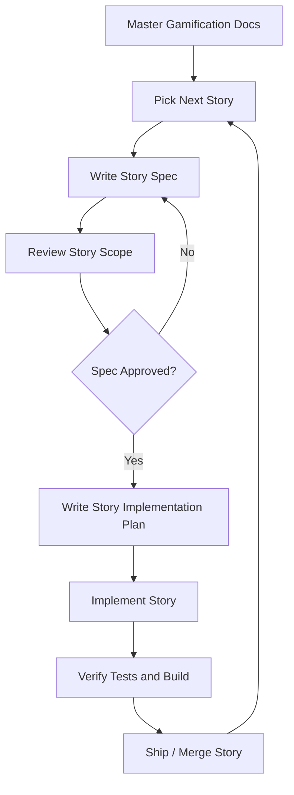
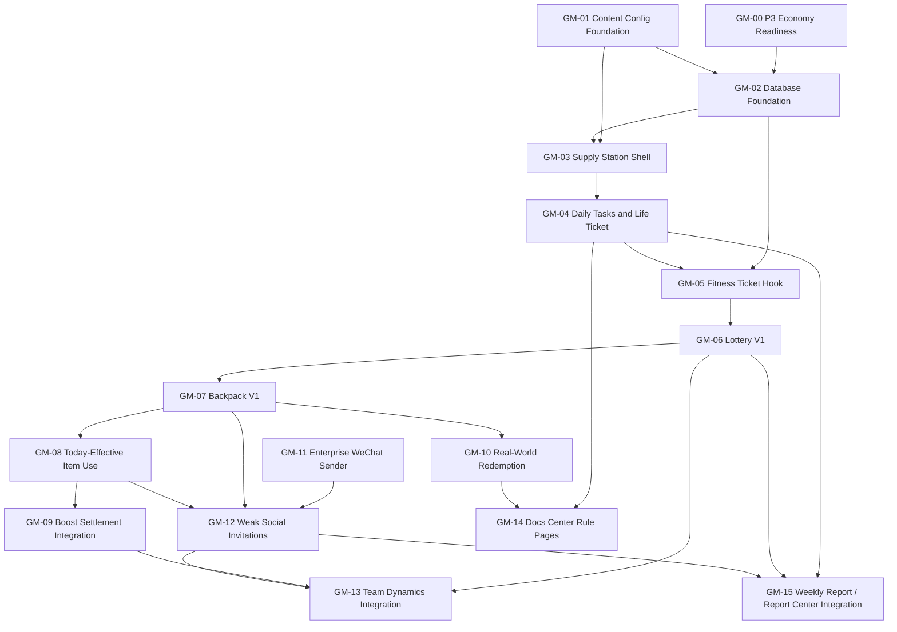

# Gamification Story Roadmap Implementation Plan

> **For agentic workers:** REQUIRED SUB-SKILL: Use superpowers:writing-plans again to create a code-level implementation plan for each story before coding. This document is the story roadmap and dependency plan, not the final per-file coding checklist.

**Goal:** Split the “牛马补给站” game loop into ordered, testable stories that can be built without turning the release into one large risky task.

**Architecture:** Build from data foundations upward: local content definitions, user state tables, ticket ledger, inventory, lottery, item use, social invitations, enterprise WeChat push, then team dynamics and report integration. The first user-facing value should be simple daily tasks and ticket earning; richer economy, boosts, real-world redemption, and weak social features come after the foundation is proven.

**Tech Stack:** Next.js App Router, TypeScript strict mode, Prisma + SQLite, Vitest + jsdom, local config modules for content definitions, enterprise WeChat robot webhook for outbound reminders.

---

## Roadmap Fit

This game update should become a new P4 mainline after the P3 season economy is stable enough to extend.

It changes the existing roadmap in three ways:

- `Quest / Todo / Auto Quest` should remain deferred. The new four-dimension daily task system is lighter and better matched to the current product than a full todo system.
- `银子消费与奖励兑换` moves from vague mid-term idea into the P4 economy loop through ticket purchase, lottery, inventory, boosts, and real-world redemption.
- `企业微信推送` becomes useful in two lanes: weekly reports from the existing roadmap, and weak social reminders from the new game loop.

Existing roadmap items and dependency relationship:

| Roadmap item | Relationship to gamification |
| --- | --- |
| P3 season polish | Required before boost settlement touches season contribution |
| 战报中心赛季复盘 | Not a blocker; should consume game stats later |
| 团队动态 | Not a blocker for v1 tasks or lottery; needed for high-value event archive |
| 文档中心 | Useful before release to explain rules; not a technical blocker |
| 手动周报 | Should come after enough game data exists to summarize |
| 企业微信 webhook | Required before weak social reminders feel complete |
| Quest / Todo / Auto Quest | Superseded for now by four-dimension daily tasks |

## Critical Path

```text
P3 settlement stability
-> content schema + database foundations
-> daily task assignments
-> ticket ledger and ticket earning
-> lottery and inventory
-> item use records
-> boost settlement integration
-> real-world redemption
-> enterprise WeChat sender
-> weak social invitations
-> team dynamics and weekly report integration
```

## Spec + Plan Workflow

The current gamification documents are master planning references. They are not meant to be implemented as one large feature.

Before implementation, each story must be split into its own pair:

```text
docs/superpowers/specs/YYYY-MM-DD-gm-XX-<story-name>-design.md
docs/superpowers/plans/YYYY-MM-DD-gm-XX-<story-name>.md
```

Rules:

- One story equals one focused spec plus one focused implementation plan.
- A story must be independently testable.
- A story may ship without visible frontend changes if it only creates config, schema, services, or API foundations.
- A story must not depend on future stories for its own tests to pass.
- Later stories can extend earlier surfaces, but should not require rewriting the earlier story.
- Code-level plans should be written only after the story-specific spec is approved.

Workflow:



Dependency map:



Story package list:

| Story | Feature | Output | Can ship alone? | Requires visible UI? |
| --- | --- | --- | --- | --- |
| GM-00 | P3 Economy Readiness Gate | Confirms punch, undo, streak, coins, and season settlement can be extended | Yes | No |
| GM-01 | Content Config Foundation | Local dimensions, task cards, reward pool, item definitions, validation | Yes | No |
| GM-02 | Database Foundation | Prisma models for tasks, tickets, inventory, item use, lottery, invitations, redemption | Yes | No |
| GM-03 | 牛马补给站 Shell | Navigation entry, page shell, aggregate state endpoint, placeholders | Yes | Yes |
| GM-04 | Daily Tasks and Life Ticket | Daily task assignment, complete, reroll, claim life ticket | Yes | Yes |
| GM-05 | Fitness Ticket Hook | Real fitness punch grants one ticket; undo blocked if spent | Yes | Small UI copy only |
| GM-06 | Lottery V1 | Single draw, ten draw, top-up, guarantee, draw history records | Yes | Yes |
| GM-07 | Backpack V1 | Inventory display and item details inside supply station | Yes | Yes |
| GM-08 | Today-Effective Item Use | Pending / settled / expired item use records and non-season item actions | Yes | Yes |
| GM-09 | Boost Settlement Integration | Boost effects applied to personal coins and season contribution | Yes | Small UI result copy |
| GM-10 | Real-World Redemption | Luckin redemption request, admin confirm/cancel, inventory refund | Yes | Yes |
| GM-11 | Enterprise WeChat Sender Foundation | Reusable outbound robot sender and formatter | Yes | No |
| GM-12 | Weak Social Invitations V1 | Social item use, WeChat reminder, response, expiry | Yes | Yes |
| GM-13 | Team Dynamics Integration | High-value game events written to Team Dynamics | Yes, if Team Dynamics exists | Mostly no |
| GM-14 | Docs Center Rule Pages | Rules and changelog content for supply station | Yes, if Docs Center exists | Yes |
| GM-15 | Weekly Report / Report Center Integration | Game stats in report center and weekly report | Yes, after data exists | Yes |

Recommended spec creation order:

1. `GM-00`
2. `GM-01` - spec written at `docs/superpowers/specs/2026-04-25-gm-01-content-config-foundation-design.md`; plan written at `docs/superpowers/plans/2026-04-25-gm-01-content-config-foundation.md`
3. `GM-02` - spec written at `docs/superpowers/specs/2026-04-25-gm-02-database-foundation-design.md`; plan written at `docs/superpowers/plans/2026-04-25-gm-02-database-foundation.md`
4. `GM-03` - spec written at `docs/superpowers/specs/2026-04-25-gm-03-supply-station-shell-design.md`; plan written at `docs/superpowers/plans/2026-04-25-gm-03-supply-station-shell.md`
5. `GM-04` - spec written at `docs/superpowers/specs/2026-04-25-gm-04-daily-tasks-life-ticket-design.md`; plan written at `docs/superpowers/plans/2026-04-25-gm-04-daily-tasks-life-ticket.md`
6. `GM-05` - spec written at `docs/superpowers/specs/2026-04-25-gm-05-fitness-ticket-hook-design.md`; plan written at `docs/superpowers/plans/2026-04-25-gm-05-fitness-ticket-hook.md`
7. `GM-06` - spec written at `docs/superpowers/specs/2026-04-25-gm-06-lottery-v1-design.md`; plan written at `docs/superpowers/plans/2026-04-25-gm-06-lottery-v1.md`
8. `GM-07` - spec written at `docs/superpowers/specs/2026-04-26-gm-07-backpack-v1-design.md`; plan written at `docs/superpowers/plans/2026-04-26-gm-07-backpack-v1.md`
9. `GM-08` - spec written at `docs/superpowers/specs/2026-04-26-gm-08-today-effective-item-use-design.md`; plan written at `docs/superpowers/plans/2026-04-26-gm-08-today-effective-item-use.md`
10. `GM-09` - spec written at `docs/superpowers/specs/2026-04-26-gm-09-boost-settlement-integration-design.md`; plan written at `docs/superpowers/plans/2026-04-26-gm-09-boost-settlement-integration.md`
11. `GM-10`
12. `GM-11`
13. `GM-12`
14. `GM-13`
15. `GM-14`
16. `GM-15`

## Story Map

### Story GM-00: P3 Economy Readiness Gate

**Feature:** Prepare the existing season and punch settlement system for game economy hooks.

**Depends on:** Current P3 work.

**What ships:**

- Confirm current `POST /api/board/punch` and `DELETE /api/board/punch` settlement behavior is stable.
- Confirm streak reward tiers, season contribution, and personal coins can be extended by item effects.
- Confirm mobile P3 polish does not block another navigation entry.

**Acceptance criteria:**

- Existing punch, undo, concurrent punch, and season cap tests still pass.
- There is a clear service boundary for adding post-punch game settlement.
- No gamification tables are required in this story.

### Story GM-01: Content Config Foundation

**Feature:** Local definitions for dimensions, task cards, rewards, and items.

**Depends on:** None, but should follow the schema in `2026-04-25-gamification-content-schema.md`.

**What ships:**

- `content/gamification/dimensions.ts`
- `content/gamification/task-cards.ts`
- `content/gamification/reward-pool.ts`
- `content/gamification/item-definitions.ts`
- Validation helpers that fail fast on duplicate IDs or invalid enum values.

**Acceptance criteria:**

- The four dimensions use stable keys: `movement / hydration / social / learning`.
- `design/game-card-design.md` can be used as task-card content input.
- Reward and item definitions are structured, not hard-coded in UI copy.
- Tests catch duplicate IDs, disabled items, invalid reward effects, and invalid dimension references.

### Story GM-02: Database Foundation

**Feature:** Add persistence for daily assignments, ticket ledger, inventory, item use, lottery, social invitation, and real-world redemption.

**Depends on:** GM-01 for config IDs and enums.

**What ships:**

- `DailyTaskAssignment`
- `LotteryTicketLedger`
- `InventoryItem`
- `ItemUseRecord`
- `LotteryDraw`
- `LotteryDrawResult`
- `SocialInvitation`
- `RealWorldRedemption`
- `User.ticketBalance`

**Acceptance criteria:**

- Prisma schema supports all confirmed user state and流水.
- `taskCardId`, `rewardId`, and `itemId` reference local config IDs, not database foreign keys.
- Ticket balance and ticket ledger can update in the same transaction.
- Inventory quantity cannot be driven negative by service logic.

### Story GM-03: 牛马补给站 Shell

**Feature:** Add the new aggregated page entry without completing the full economy.

**Depends on:** GM-01, GM-02.

**What ships:**

- `牛马补给站` navigation entry.
- `GET /api/gamification/state`.
- Page sections for today tasks, reward status, lottery placeholder, backpack summary, and social invitations placeholder.

**Acceptance criteria:**

- A signed-in user can open the page on desktop and mobile.
- The page shows today’s four dimensions even before tasks are completed.
- Empty states make it clear which features are not active yet.
- The page does not require team dynamics, weekly report, or enterprise WeChat to exist.

### Story GM-04: Daily Tasks and Life Ticket

**Feature:** Let users complete four daily tasks and claim the life ticket.

**Depends on:** GM-03.

**What ships:**

- Daily task assignment generation.
- `POST /api/gamification/tasks/complete`.
- `POST /api/gamification/tasks/reroll`.
- `POST /api/gamification/tasks/claim-ticket`.
- Ticket ledger entry for four-dimension completion.

**Acceptance criteria:**

- Each user has one current task per dimension per Shanghai day.
- Each dimension can be rerolled once per day.
- Completing all four dimensions unlocks one explicit life-ticket claim.
- Claiming twice on the same day is impossible.
- Completing tasks does not create fitness punch records or season contribution.

### Story GM-05: Fitness Ticket Hook

**Feature:** Award one lottery ticket from a real fitness punch.

**Depends on:** GM-02, GM-04, stable punch settlement from GM-00.

**What ships:**

- Real fitness punch grants one daily fitness ticket.
- Ticket grant uses `LotteryTicketLedger`.
- Undoing a punch rolls back the ticket only if the granted ticket has not been spent.
- If the granted fitness ticket has already been spent, punch undo is blocked with a clear user-facing提示.
- No compensation, negative balance, or debt rule is created for already-spent fitness tickets.

**Acceptance criteria:**

- One real fitness punch can grant at most one ticket per day.
- A leave coupon does not grant a fitness ticket.
- Ticket grant and punch settlement are transactionally consistent.
- If the granted ticket has already been spent, undo returns a clear message and leaves the punch intact.

### Story GM-06: Lottery V1

**Feature:** Single draw and ten draw with coin top-up and conservative guarantee.

**Depends on:** GM-02, GM-04, GM-05.

**What ships:**

- `POST /api/gamification/lottery/draw`.
- Single draw without guarantee.
- Ten draw with at least one utility-or-better result.
- Coin top-up for ten draw when user has at least seven tickets.
- Ticket price `40` coins, daily purchase cap `3`.
- No standalone ticket purchase endpoint in v1; coin purchase only exists as ten-draw top-up.

**Acceptance criteria:**

- Draw, ticket spend, coin spend, reward result, coin reward, and inventory reward happen in one transaction.
- Ten draw cannot start from fewer than seven tickets.
- Coin top-up can only happen inside ten draw confirmation.
- Ten draw guarantee does not guarantee rare boost.
- Coin reward expectation remains below ticket purchase cost.
- Lottery history can display the result snapshot even if config copy later changes.

### Story GM-07: Backpack V1

**Feature:** Show inventory and basic item categories in the supply station.

**Depends on:** GM-06.

**What ships:**

- Backpack section inside `牛马补给站`.
- Grouping by boost, protection, social, lottery, cosmetic, real-world.
- Inventory quantities from `InventoryItem`.
- Item detail panel with effect, usage limit, and whether admin confirmation is required.

**Acceptance criteria:**

- Users can see all owned items and quantities.
- Items with zero quantity do not appear as usable inventory.
- The UI distinguishes permanent inventory from today’s pending effects.
- No separate `/bag` route is required in this story.

### Story GM-08: Today-Effective Item Use

**Feature:** Use boosts, task reroll, and leave protection through `ItemUseRecord`.

**Depends on:** GM-07.

**What ships:**

- `POST /api/gamification/items/use`.
- Today-effective pending state.
- Immediate same-day补结算 if a real fitness punch already exists.
- Pending settlement if the user has not punched yet.
- Leave protection for streak continuity and reward-tier freeze.

**Acceptance criteria:**

- Boosts are manually used.
- Small boost and strong boost cannot both affect the same day.
- Strong boost can be used at most once per user per week.
- Pending boosts do not consume inventory until settlement succeeds.
- If the day ends without a real fitness punch, pending收益增益 expires without consuming inventory.
- Leave protection does not grant ticket, coins, season contribution, or boost trigger.

### Story GM-09: Boost Settlement Integration

**Feature:** Apply item effects to personal coins and season contribution during or after punch settlement.

**Depends on:** GM-08 and P3 settlement stability.

**What ships:**

- `小暴击券`: same-day fitness coin `1.5x`.
- `银子暴富券`: same-day fitness coin `2x`.
- `赛季冲刺券`: same-day season contribution `2x`.
- `双倍牛马券`: same-day fitness coin and season contribution `2x`.
- Clear settlement output for UI and tests.

**Acceptance criteria:**

- Boost settlement is idempotent.
- Boosts cannot push season progress beyond the existing season cap rules.
- Punch undo rolls back boost effects consistently.
- Boost effects are visible in the user-facing result copy.

### Story GM-10: Real-World Redemption

**Feature:** Redeem 瑞幸咖啡券 through admin confirmation.

**Depends on:** GM-07.

**What ships:**

- `POST /api/gamification/redemptions/request`.
- `POST /api/admin/gamification/redemptions/confirm`.
- `POST /api/admin/gamification/redemptions/cancel`.
- Inventory扣减 on request; refund on cancel.

**Acceptance criteria:**

- A user can request a Luckin redemption only if inventory quantity is available.
- Admin can confirm the redemption.
- Admin can cancel a `REQUESTED` redemption and return the item to the user's inventory.
- `CONFIRMED` redemption cannot be cancelled.
- Redemption does not automatically create a coffee record.
- Redemption status is visible to the user.

### Story GM-11: Enterprise WeChat Sender Foundation

**Feature:** Generic outbound webhook sender for future weekly reports and weak social reminders.

**Depends on:** None technically, but should ship before GM-12.

**What ships:**

- Server-side enterprise WeChat robot sender.
- Message formatter for simple text or markdown.
- Config source, initially environment variable or admin setting if already available.
- Send result logging enough to troubleshoot failures.

**Acceptance criteria:**

- Missing webhook config fails gracefully.
- Failed send does not roll back local business state unless the specific action requires it.
- Sender can be reused by weekly report and weak social messages.

### Story GM-12: Weak Social Invitations V1

**Feature:** Use weak social items to invite teammates and send enterprise WeChat reminders.

**Depends on:** GM-07, GM-08, GM-11.

**What ships:**

- `SocialInvitation` creation from social item use.
- `POST /api/gamification/social/respond`.
- Enterprise WeChat reminder on invitation create.
- Same-day expiry.
- Response record and display material settlement only after response; v1 weak social does not grant coins.

**Acceptance criteria:**

- Sender can target one member or the whole team depending on item type.
- Enterprise WeChat failure does not prevent the in-app invitation from existing.
- Recipient can respond or ignore.
- Expired invitations do not settle rewards.
- Weak social responses do not grant coins in v1.
- Team broadcast items respect per-team daily limits.

### Story GM-13: Team Dynamics Integration

**Feature:** Persist only high-value game events into team dynamics.

**Depends on:** Team Dynamics v1, GM-06, GM-09, GM-12.

**Blocking status:** Not a blocker for `牛马补给站` MVP. This story is a later integration point with the mainline Team Dynamics feature.

**What ships:**

- Rare prize event.
- Multi-person weak social response event.
- Four-dimension full-completion streak event.
- Boost milestone event, such as double coupon used on target-reaching punch.

**Acceptance criteria:**

- Ordinary task completion and ordinary point-name events do not flood team dynamics.
- Dynamic payloads contain enough snapshot data to render later.
- If team dynamics is not ready, game core still functions without this story.
- `牛马补给站` can ship without writing any events to Team Dynamics.

### Story GM-14: Docs Center Rule Pages

**Feature:** Explain game rules in the docs center.

**Depends on:** Docs Center v1, stable decisions from GM-04 through GM-10.

**What ships:**

- Rules for tickets, ten draw, coin purchase, inventory, boosts, leave protection, weak social, and Luckin redemption.
- Changelog entry for 牛马补给站.

**Acceptance criteria:**

- New users can understand why they got one or two tickets.
- Boost and leave protection rules are explicit.
- Real-world redemption is described as admin-confirmed offline fulfillment.

### Story GM-15: Weekly Report and Report Center Integration

**Feature:** Use game data in team recap surfaces after data has accumulated.

**Depends on:** GM-04, GM-06, GM-12, manual weekly report or report center season recap.

**What ships:**

- Four-dimension completion stats.
- Ticket earned and lottery participation summary.
- Rare prize highlights.
- Weak social response highlights.
- Optional weekly report block.

**Acceptance criteria:**

- Report center can render without game data.
- Weekly report uses aggregated records, not live random recalculation.
- Report copy remains readable and does not expose every low-value action.

## Recommended Release Slices

### Slice 1: Foundation, No Public Gameplay

Stories:

- GM-00
- GM-01
- GM-02

Outcome:

- Content definitions, schema, and state tables exist.
- No new heavy user-facing gameplay yet.

### Slice 2: 牛马补给站 MVP

Stories:

- GM-03
- GM-04
- GM-05

Outcome:

- Users can complete four daily tasks.
- Users can earn up to two free tickets per day.
- No lottery yet, so economy risk stays low.

### Slice 3: Lottery and Backpack

Stories:

- GM-06
- GM-07

Outcome:

- Users can spend tickets, use coins to补齐十连, and see inventory.
- Personal coins now have a clear use.

### Slice 4: Boosts and Leave Protection

Stories:

- GM-08
- GM-09

Outcome:

- Inventory starts affecting fitness and season settlement.
- This is the highest-risk economy slice and should have the strongest tests.

### Slice 5: Redemption and Enterprise WeChat

Stories:

- GM-10
- GM-11
- GM-12

Outcome:

- Real-world Luckin redemption works.
- Weak social items become useful through enterprise WeChat reminders.

### Slice 6: Archive and Recap

Stories:

- GM-13
- GM-14
- GM-15

Outcome:

- High-value game moments enter team dynamics.
- Rules enter docs center.
- Report center and weekly report can summarize the game loop.

## Implementation Order

Recommended order:

1. GM-00: P3 Economy Readiness Gate
2. GM-01: Content Config Foundation
3. GM-02: Database Foundation
4. GM-03: 牛马补给站 Shell
5. GM-04: Daily Tasks and Life Ticket
6. GM-05: Fitness Ticket Hook
7. GM-06: Lottery V1
8. GM-07: Backpack V1
9. GM-08: Today-Effective Item Use
10. GM-09: Boost Settlement Integration
11. GM-10: Real-World Redemption
12. GM-11: Enterprise WeChat Sender Foundation
13. GM-12: Weak Social Invitations V1
14. GM-13: Team Dynamics Integration
15. GM-14: Docs Center Rule Pages
16. GM-15: Weekly Report and Report Center Integration

## Not In P4 MVP

- Full Todo / Quest / Auto Quest system.
- Rank ladder.
- Marketplace with many purchasable items.
- Trading or gifting items between users.
- Automatic scheduled weekly reports.
- Enterprise WeChat OAuth or command callbacks.
- Native mobile app.

## Open Decisions Before Code-Level Plans

None. Current story-level decisions are ready for code-level planning.
